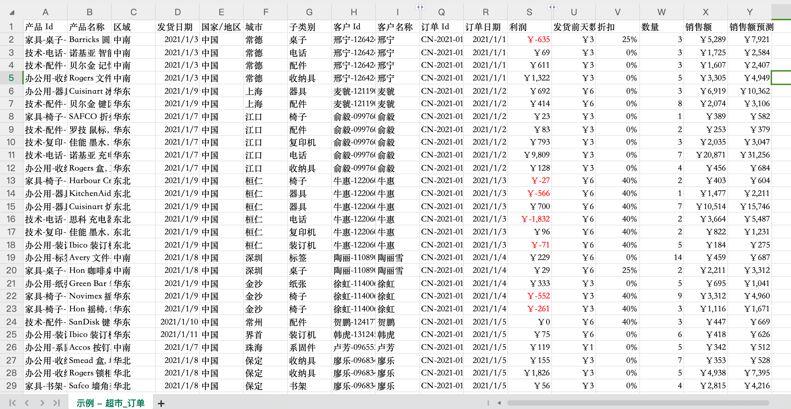
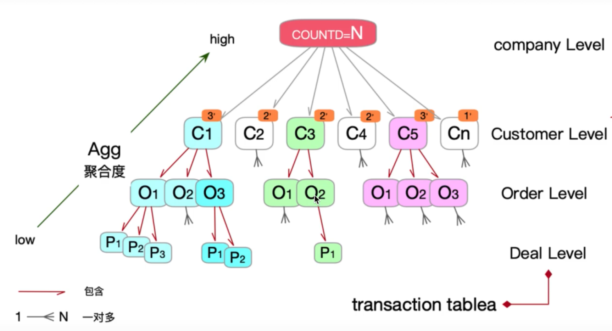
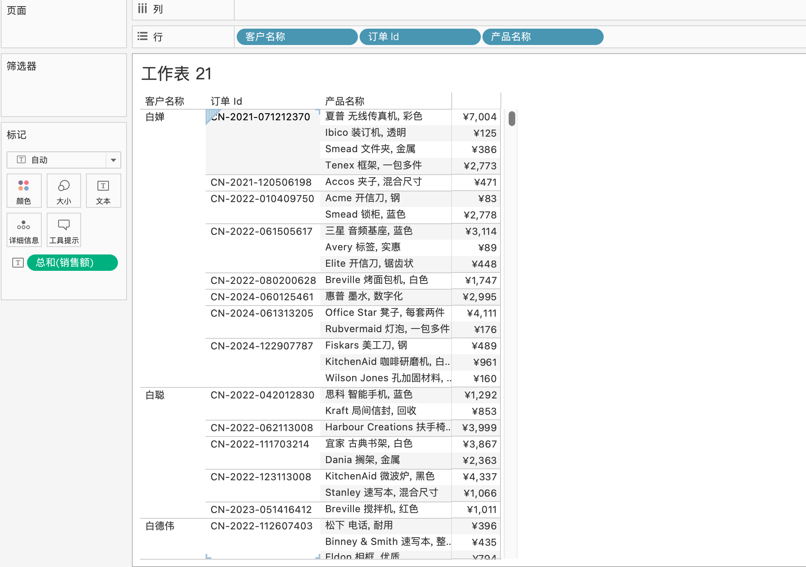
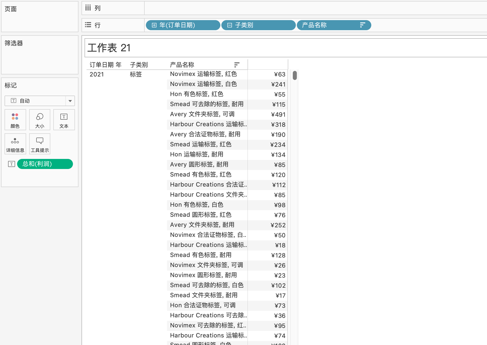
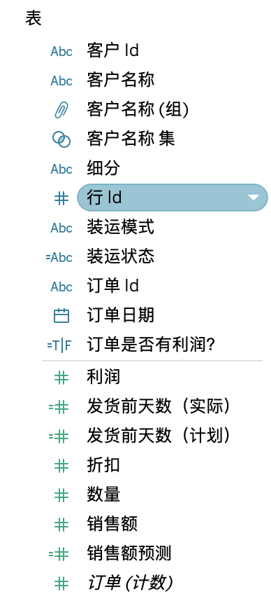
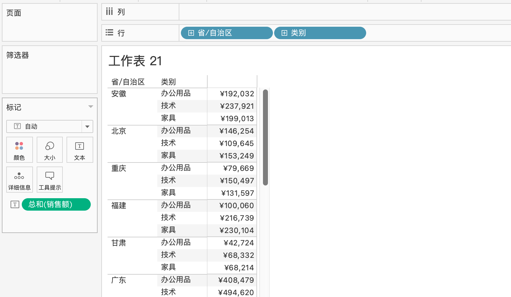

# 从数据角度出发

## 数据的产生

数据是从业务的流程产生，这是最底层的数据，在这一层面数据的颗粒度最细  
以`示例超市`里面的 *订单* 数据为例  

可以清楚看到，订单的销售日期，卖了哪些产品，具体哪天发货，销售额是多少，销售数量是多少等等  

这份表格数据是理想状态下的，所有**关键**的字段都在一个表格里  
在真实的业务场景中，这些字段其实是分布在不同的表格中的  
这需要人为的对获取的数据进行清洗，然后在表格之间进行链接，汇总需要的字段  

这张表格其实已经包含了tableau所常用的字符  
例如：日期时间、字符串、数值、地区等等

## 数据的层次

**数据的层次** 是一个相当重要的概念，理解关键是 **理解数据之间的层次关联**，是后续对数据计算、分析的关键所在（特别是lod计算）  

从下图可以看到，数据的聚合度从低到高  
层次结构从高到低：公司 -> 客户 -> 订单 -> 交易  
如何理解？  
所有数据都在一张数据表格里面，所有的客户都是购买同一家公司的产品，有些客户只购买了一个订单，有些客户购买了多个订单，订单下面可能购买单个产品或者多个产品  

[图片是从喜乐君老师的视频截取的](https://www.bilibili.com/video/BV1ZR4y157ka?spm_id_from=333.788.videopod.sections&vd_source=07a1e0660861b385495b07d16fcc9d4c)

以超市的订单数据为例，构建出这样一个层次图，聚合度从高到低  
层次结构：客户名称 -> 订单号 —> 产品名称 —> 销售额


也可以查看每天每个子类别下面的每个产品具体的利润是多少  
层次结构：每天 -> 子类别 —> 产品名称 -> 利润


举这个例子是说，同一张表格，可以从需要的字段去做维度分析，只需想清楚字段之间的层次关联，就能搭建出相对应的图表  

```md
这里有一个很重要点，对于想要分析的数据，必须有一个大概的了解，清楚数据与数据关联性，是后面分析数据的关键，所有的分析都是基于这步开始  
```

## 维度和度量

> 刚开始接触tableau的时候，看到维度跟度量这两个词还是有点懵的  
> 后面看多了，接触了多了也就熟悉了  

维度和度量，可以浓缩成这样子的一句fei话  
数据表里面的所有字段,要么是度量,要么是维度,也可以即是度量也是维度(日期时间)  

以的**超市-订单表**为例：  
维度：产品 Id,产品名称,区域,国家/地区,城市,子类别,客户 Id,客户名称,省/自治区等  
度量：利润,发货前天数,折扣,数量,销售额等  
度量&维度：发货日期，订单日期等（**日期格式**）  
>**日期时间**值得我专门另开篇章重点介绍，原因很简单，很多分析都绕不开时间这个维度，但是它跟传统的维度又有一定区别  

维度与度量在tableau中，它其实已经帮我们区分好了  
**蓝色的字段**是维度；**#号开头、绿色的字段**是度量



从图中的维度字段，我们可以进行更进一步的抽象  
`字符串就是维度，数值就是度量`  

## 维度是聚合的依据

搞清楚了什么是维度，什么是度量，**我们再进一步**  

通过维度的先后层次，决定度量的计算逻辑  
这里要着重提到一个知识点：  
`维度是聚合的依据！！！是度量统计执行计算的重要依据`，这句话怎么强调都不过分  

**维度是聚合的依据**如何更好理解？  
很简单的，就是**excel的数据透视表**，一点就透  

以下图为例，查看每个地区每个类别的销售情况  
层次：省份 -> 类别 -> 销售额  



b站上面绝大多数tableau教程视频做图就只做到**数据透视表**这个层次，相当入门  

真实业务场景下，往往比这个例子复杂许多  
除了会涉及**更多的维度**，例如日期，子类别，订单是否盈利，折扣等等  
还有**筛选器**，例如只看第一季度、订单利润大于0等等  
这需要学习更高阶的lod计算，后面我会重点介绍  

## 总结

* 了解数据表中的数据，弄清楚数据之间的层次关联  
* 了解字段维度与度量之间的区分  
* 了解**多维度**下**度量的计算逻辑**（数据透视表）  
