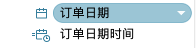
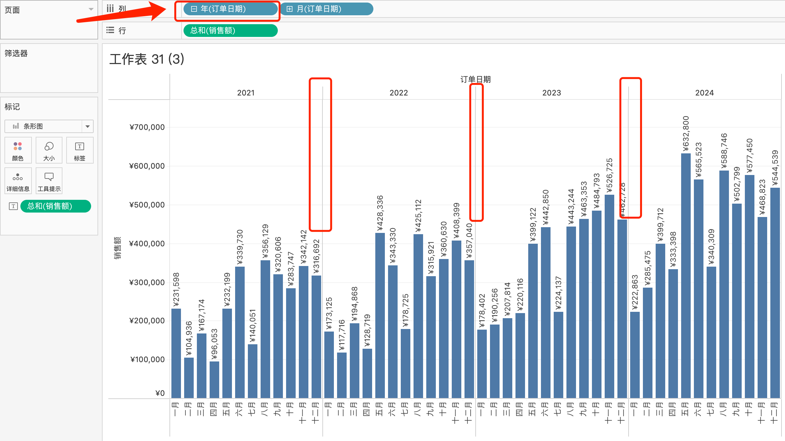
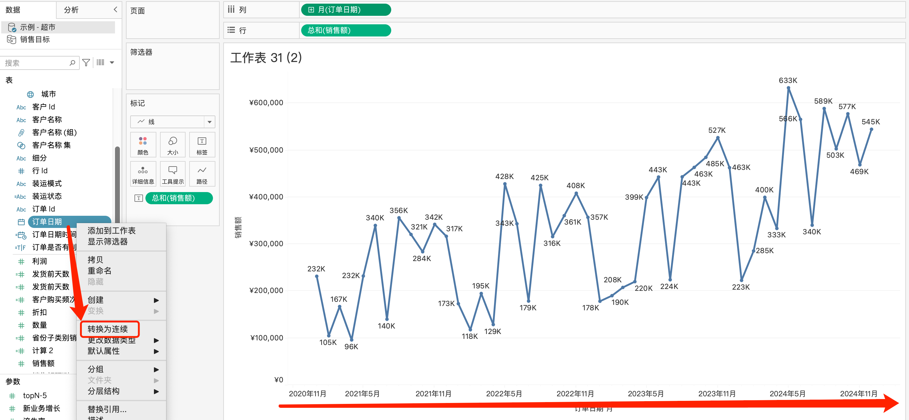
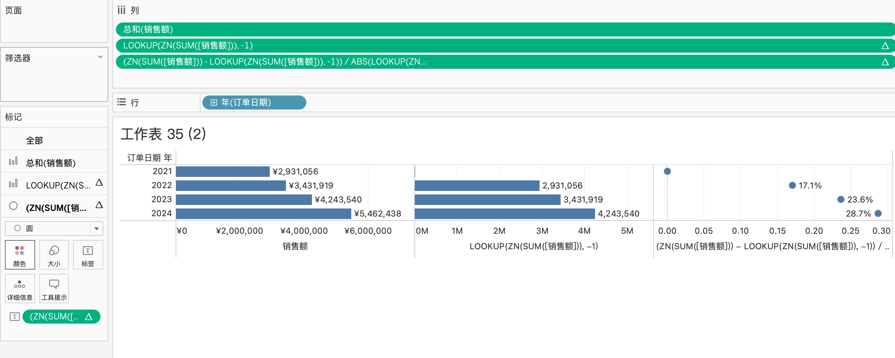

# 日期时间

日期时间专门用一个小章节讲述，不是因为它有多难，**而是因为它很重要**  

人是消费动物，会在各个平台购物，每一次的购买，都会生成一条交易记录，不管最终是否成交  
而这条交易记录，会记录购买的日期，甚至具体到那个时间点下单，这为后续按天、按月、按季等等分析提供了时间维度，同环比也是建立在时间维度基础上，例如今年三月份销售额同比去年销售额是增加了还是降低了？  

## 日期类型

在tableau中，日期时间可以理解成只有两种类型  
一个是**日期（不含时间）**，一个是**日期时间（包含时间）**  
图形其实很好区分的，有时钟的是日期时间，这个字段其实用的比较少，多数分析会以**天**为分析维度  
这里的区分很有必要，在tableau表链接中，**日期**与**日期时间是**不同格式，不能连接起来  

## 日期也可以聚合

日期在tableau相对特殊，因为tableau提供了一个相当便捷的功能，那就是**日期维度的聚合**

                聚合度由低到高：天 ——> 周 ——> 月 ——> 季度 ——> 年  

例如，在示例-超市-订单里面，数据表的日期是天，但是我们可以通过右键，把聚合度由天变成月份，通过维度先指定年，再指定月，就能做出条形图  

这跟excel透视表一样的，就是按照**年、月的维度**，**聚合销售额**，展示的是条形图  
仔细观察，会发现各年份是分割开的，它们的边界存在一条间隔线  

同样的，我们可以更改日期的维度，让它变成连续型，让整个图形变成折线图，而不是条形图  
这时候，就没有**维度边界线**了，日期从小到大排序  

涉及日期维度的图形，尽量多多尝试，或者多看大佬们做的图形，才能知道如何更好展示数据  

我们可以简单做一个表以**区分日期的连续与维度**  

 特性               | 连续日期（Continuous）                          | 维度日期（Discrete）                     |
|--------------------|-----------------------------------------------|-----------------------------------------|
| **数据性质**        | 视为数值型度量（时间序列）                      | 视为分类维度（时间类别）                 |
| **坐标轴类型**      | 生成连续轴（可细分）                        | 生成离散轴（按固定颗粒度分段）           |
| **展示形式**    | 显示为绿色胶囊（度量标识）                      | 显示为蓝色胶囊（维度标识）               |
| **时间颗粒度**      | 默认显示原始精度（可聚合）                    | 自动聚合为默认颗粒度（可聚合）   |
| **图表类型适配**    | 适合折线图、面积图等趋势分析                    | 适合柱状图、条形图等对比分析

## 日期维度下的同环比

-- 同环比的计算，尽管公式不涉及日期，但却是在日期的维度上建立起来的

            sum(销售额)
            LOOKUP(ZN(SUM([销售额])), -1))
            (ZN(SUM([销售额])) - LOOKUP(ZN(SUM([销售额])), -1)) / ABS(LOOKUP(ZN(SUM([销售额])), -1))

看起来很复杂，但理解起来确很简单

还是举一个例子，想看每年销售额的同比，维度是年，所以`sum(销售额)`聚合的是每年的销售额  

ZN() 是一个用于处理 NULL 值的函数，全称为 Zero Null。它的核心作用是将字段中的 NULL（空值）转换为数值 0，而对非空值则保留原值  
LOOKUP() 函数用于访问当前行相对于其他行的数据，类似于 Excel 中的偏移（OFFSET）功能。它的核心作用是 基于当前视图的排序和分区，获取指定偏移量的相邻数据。  

2021年销售额那行，找不到2020年的销售额，没有这个值，所以`LOOKUP(ZN(SUM([销售额])), -1))`返回的是0，而不是NULL  

而在2022年中，`LOOKUP(ZN(SUM([销售额])), -1))`显示的值则是2021年的销售额  

这只是一个简单的例子，但只要计算同环比，都是这个计算逻辑  
  

>总结：
>
>1. 了解tableau的日期时间主要有两种形式，一种是日期，另一种是日期时间  
>2. 日期也可以聚合，聚合度由低到高：天 —> 周 —> 月 —> 季度 —> 年
>3. 日期即可以是连续，也可以是维度，根据实际需要进行选择  
>4. 明白同环比的计算逻辑，后期遇到各种复杂的日期计算，可以寻求deekseep帮助  
