# 高级计算lod（上）

tableau中，有一个叫lod的高级计算，就是fixed、include、exclude三条计算公式，它们公式的框架都是类似的，只是关键字不同  

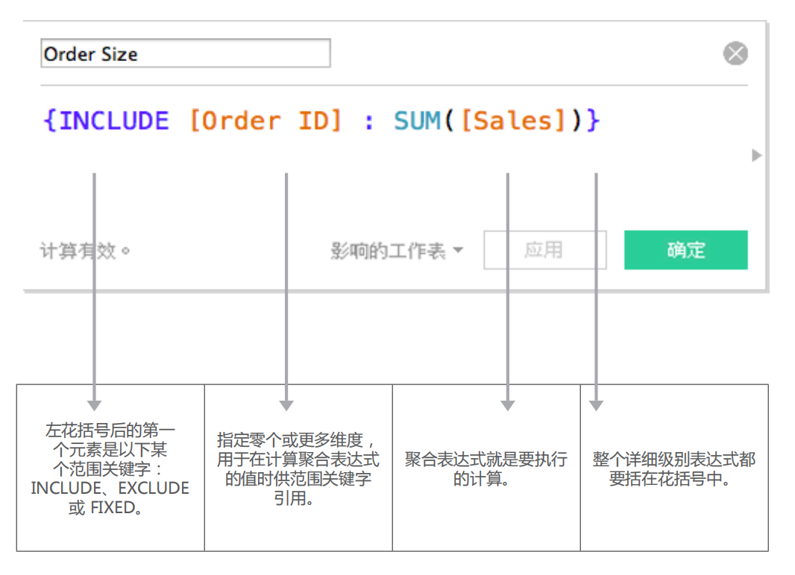

lod它们都有一个统一的点，就是**跨原先维度** *聚合* **其它维度的数据**,这就是lod`高级`的地点

## fixed表达式

从这里开始讲解新手难以理解的概念**fixed**表达式

**fixed**可以理解成 **固定的**  
**通过fixed固定的维度**去**统计**字段（这个字段，可以是维度，也可以是度量）  
通过fixed计算得到的列，是在原数据表里所没有的列，**是我们想要新增的计算列**  

以**实例-超市的订单**为例，我想要获取每个客户购买的频次  
但是数据表里，没有这么一个列，这时候就可以考虑是否可以通过新增一列达到自己的需求，而fixed表达式刚好就可以满足我们这个需求  

           {FIXED [客户名称]:COUNTD([订单 Id])}  

通过固定**客户名称**这列，然后用**countd聚合函数**统计每个客户下了多少个**订单 id**，然后给这列取名为**客户购买频次**（注意，这里的**countd函数是去重计算**）  

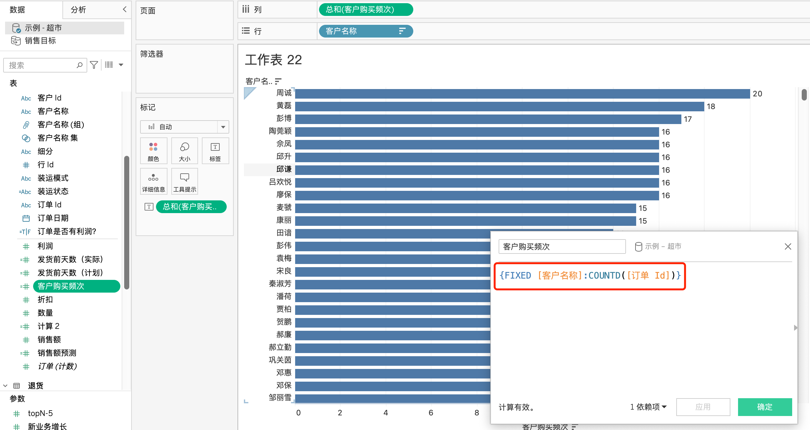

## fxied过程拆解

### excel视角

从excel数据表出发，拆解**fixed**过程中发生了什么  
因为fixed指定了客户名称，所以会统计每个客户的下了多少订单  
以周诚为例，从数据表中可以看到，一共有32行交易数据，但是只下了20个订单，所以他的购买频次为20，其他客户也是按照此逻辑去计算的  
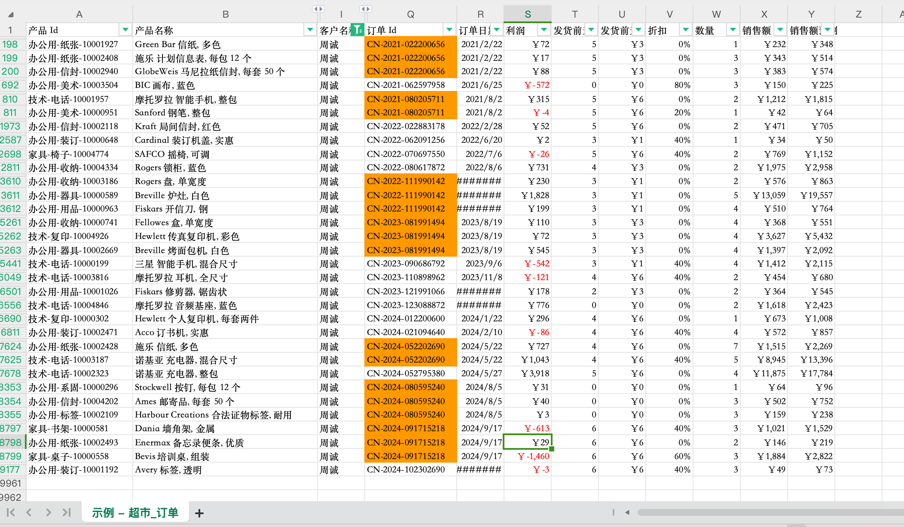
在tableau中，聚合的结果呈现是这样子的
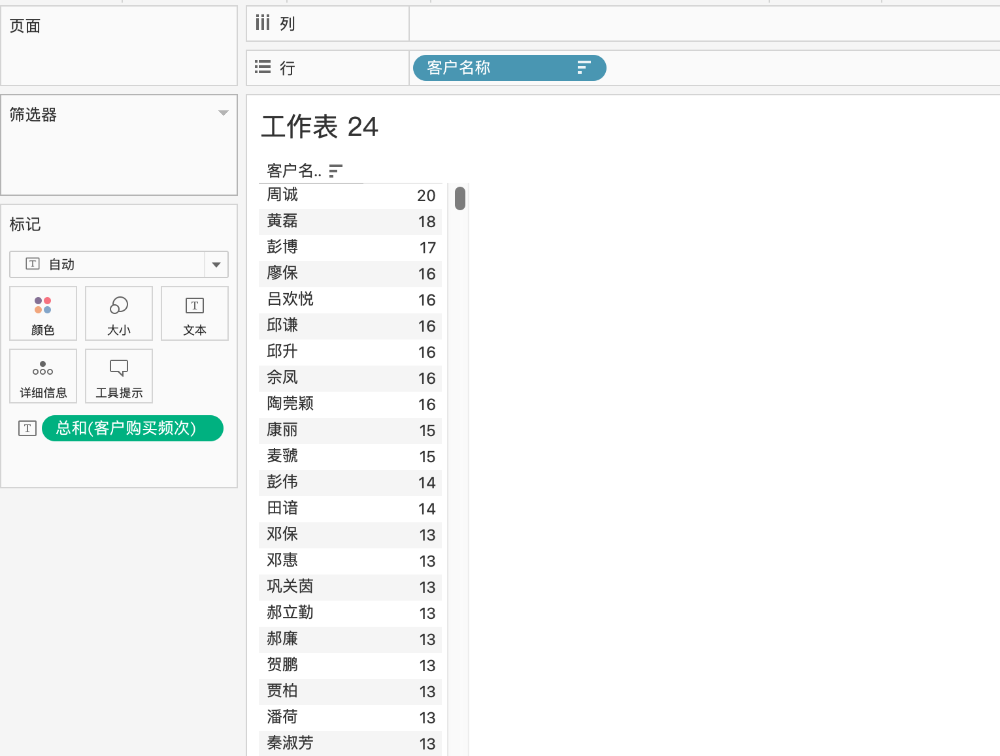

### python视角

如果熟悉pandas或者sql的代码，更容易理解fixed这个函数在tableau如何运作  
其实说白了，就是**groupby**函数  

```python
import pandas as pd

df = pd.read_excel('示例 - 超市_订单.xlsx')
df_sub = df.loc[:, ['客户名称', '订单 Id', '销售额', '类别', '子类别', '城市', '省/自治区']]  # 筛选我们需要的字段

for a, b in df_sub.groupby('客户名称'):  # 以客户名称为维度，对数据表进行分组
    print(a, b)  
```

完整展示结果需要自己搭建一个python环境，然后跑通上面的代码
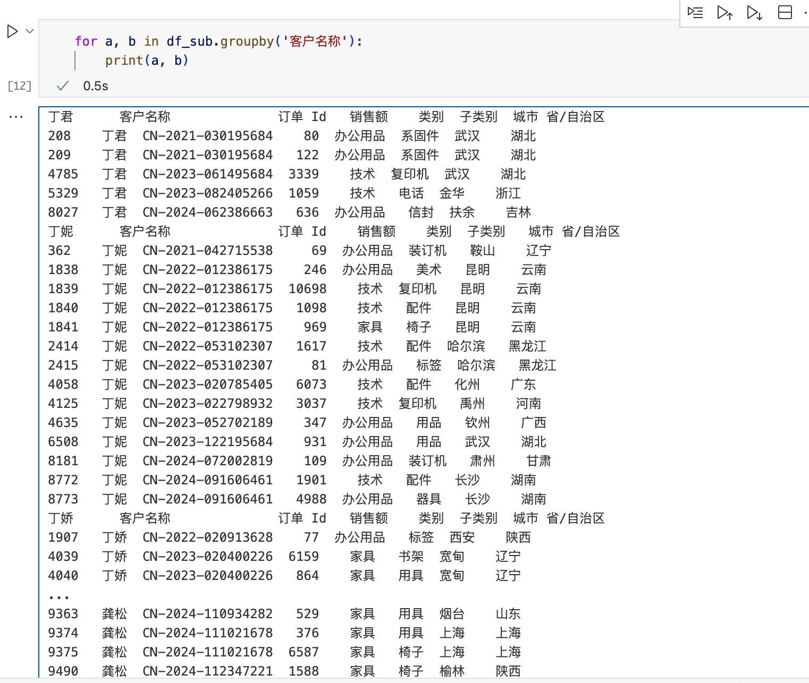

这段代码的意思是说按照给**客户名称**给分组，举其中一个客户*丁君* 为演示  
我们可以看到，*丁君* 有5条消费明细，但其中有两条订单号是重复的，所以只下了4个订单  

| 序号 | 客户名称 | 订单 ID           | 销售额 | 类别     | 子类别 | 城市 | 省/自治区 |
|------|----------|-------------------|--------|----------|--------|------|-----------|
| 208  | 丁君     | CN-2021-030195684 | 80     | 办公用品 | 系固件 | 武汉 | 湖北      |
| 209  | 丁君     | CN-2021-030195684 | 122    | 办公用品 | 系固件 | 武汉 | 湖北      |
| 4785 | 丁君     | CN-2023-061495684 | 3339   | 技术     | 复印机 | 武汉 | 湖北      |
| 5329 | 丁君     | CN-2023-082405266 | 1059   | 技术     | 电话   | 金华 | 浙江      |
| 8027 | 丁君     | CN-2024-062386663 | 636    | 办公用品 | 信封   | 扶余 | 吉林      |

但这仅仅是完成了分组而已，tableau还更进了一步，那就是**分组之后的聚合计算**  
以上面客户购买频次为例，用python完成演示是这样子的  

```python
d = {}  # 创建一个空字典 dict

for a, b in df_sub.groupby('客户名称'):  # 以客户名称为维度，对数据表进行分组
    d[a] = b['订单 Id'].nunique()  # 以客户名称为key，订单去重后的value保存到字典d中  

print(d)  
```

这段代码运行完的结果就是一个字典dict，tableau其实底层运算逻辑也是一样的  
这里搞清楚后，后面的内容理解起来会轻松很多  

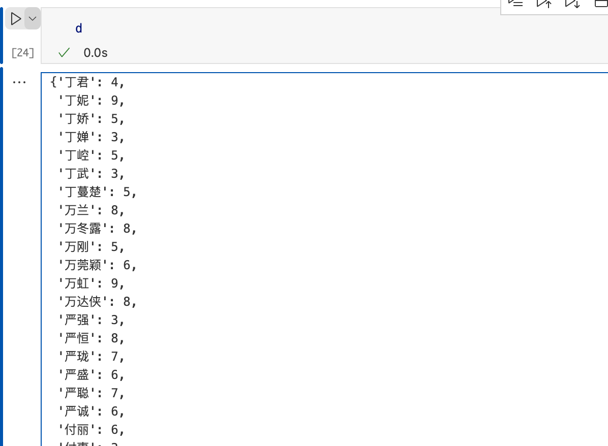

>很多视频教程其实都没有细致到我这个程度，最开始我接触到fixed函数，也是很懵逼，这到底是啥函数，作用是什么，找了好多个视频，但只是演示了fixed的怎么用而已，没有讲明白fixed的具体运作逻辑是啥  

## 多维度下的fxied

前面的例子，fixed只指定了一个**客户维度**，其实我们可以指定更多的维度，进行更复杂的计算来满足我们的做图需求  

举个例子，我想看*某个城市* 下*桌子* 的*销售额* 情况，同时想看它与*省份*、*全国* 的销售情况  
先分析问题，就是它不同于常规的excel数据透视表  
它要求在一个图表里面，**涉及了多个维度的数据，这时候第一反应就可以想到了fixed**了  
既要看到**城市**的桌子的销售额，  
也要看到**省份**的桌子的销售额，  
还要看到**全国**的桌子的销售额

我们可以这样做，就是以城市、桌子作为维度，用fiexd构建两个公式

            SUM([销售额])
           {FIXED [省/自治区],[子类别]:SUM([销售额])}
           {FIXED [国家/地区],[子类别]:SUM([销售额])}

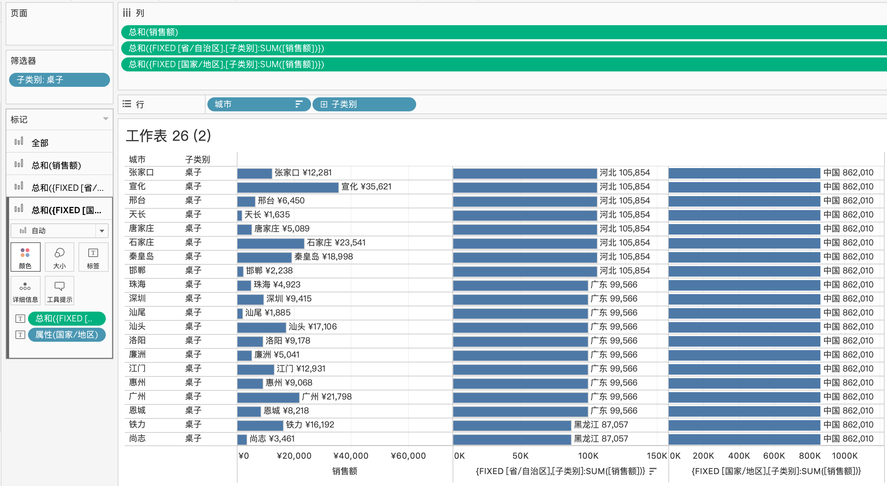

这里需要着重解释一下最开始的**维度聚合是城市，然后子类别**，销售额是根据这两个维度做的聚合，所以聚合的值是每个城市桌子的销售额，这就是excel的数据透视表  
后面通过fixed聚合了**省/自治区**,**子类别**两个维度的销售额，省份包含城市，**tableau自动帮我们在做了默认链接**，显示**城市所属省份的桌子的销售额**  
最后面的fixed聚合了**国家/地区**,**子类别**两个维度的销售额，国家包含城市，**tableau自动帮我们在做了默认链接**，而国家的桌子销售额都是一样的`862010`  

这里有个点需要注意，就是最开始的两个维度，先城市，后子列别  
所以后面的fixed字段，需要指定省份、子列别，这样子作出的图才有意义  
因为层级关系，tableau自动帮我们做了默认连接，省份包含城市，例如广东包含广州，所以广州后面显示的是广东桌子的销售额，而不是广西的销售额  

## 跨维度的fixed聚合

前面的例子，其实比较好理解，不管是城市，省份，国家，后面第二层级的维度都是子类别，整体能更好理解  

所以在这里再举一个例子，跨维度的fixed聚合  

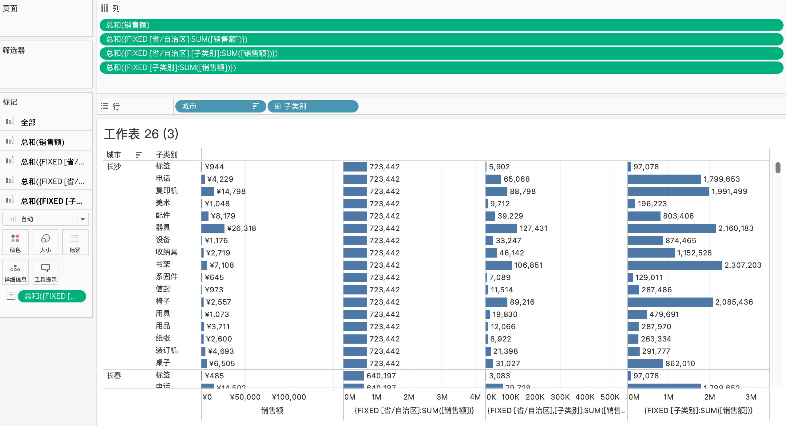

            sum(销售额)
            {FIXED [省/自治区]:SUM([销售额])}
            {FIXED [子类别]:SUM([销售额])}
            {FIXED [省/自治区],[子类别]:SUM([销售额])}

一共涉及了4个公式
第一个公式很好理解，常规数据透视表的应用，每个城市每个子类别的销售额  
第二个公式fixed的维度是**省份**，所以它算出来的是**城市所属省份的销售额**  
第三个公式fixed的维度是**子类别**，所以它算出来的是**所属子类别的整体销售额**  
第三个公式fixed的维度是**省份、子类别**，所以它算出来的是**所属省份下面的子类别的整体销售额**  

>仔细思考这几个公式之间的区别，会对fixed的运算过程有更加深刻的理解，也会间接明白fixed最后聚合的结果是否符合自己期待的值  
>很少有教程讲得这般细致，确实可以自夸一波  

## fixed优先级

fixed也固定了后面的聚合的值的范围（这个值即可是维度，也可是度量）

还是从数据的excel报表出发，excel的数据透视表可以添加筛选器，excel透视表是聚合的是**筛选后的**数值  

举个例子，我想筛选出每个省份办公用品的销售额，用excel展示如下  

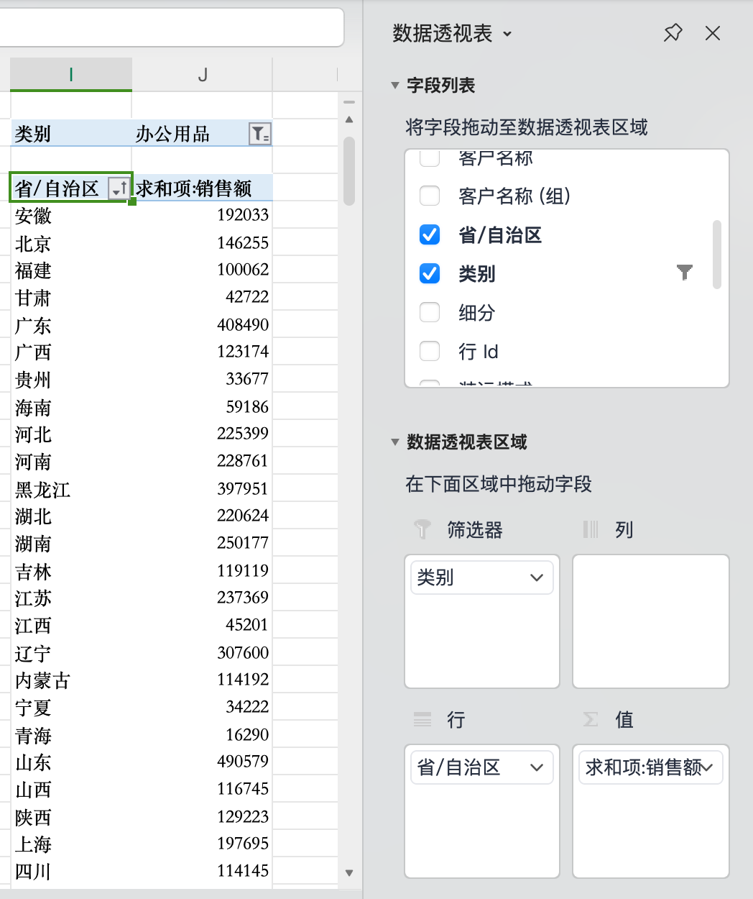

同样我们用tableau对同样的数据表进行同样筛选，每个省份办公用品的销售额

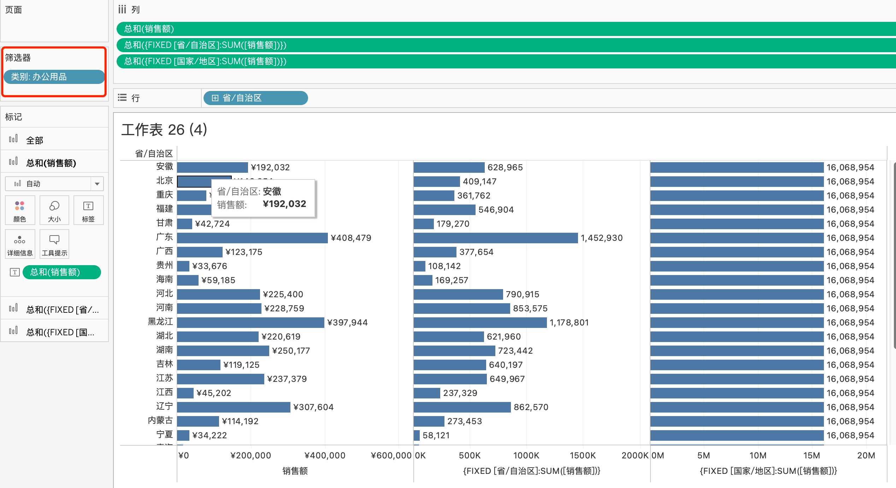

现在我们去掉`办公用品`的这个筛选条件，观察后面两个fixed所聚合的值，发现不管加不加筛选条件，fixed所聚合的值都是一样的  

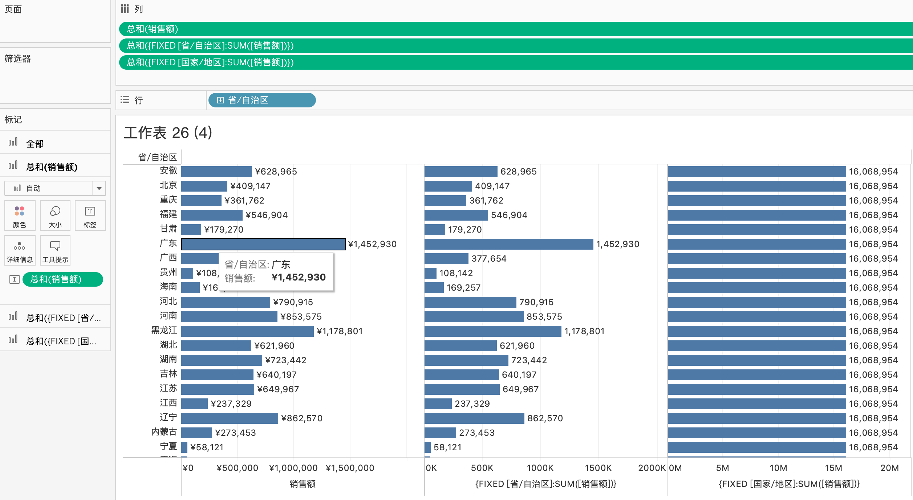

所以，fxied不单单**固定了的维度**，包括后面**计算的值的范围**从一开始就已经固定了  

这里会涉及一个优先级，也就是**fixed计算优先级**大于**维度筛选器的优先级**  

如果我们也想说，fixed聚合的值跟筛选器同步呢？其实也很好解决，那就是把筛选器添加到上下文环境中即可  

这时候我们可以看到，fixed的聚合的值发生了改变  
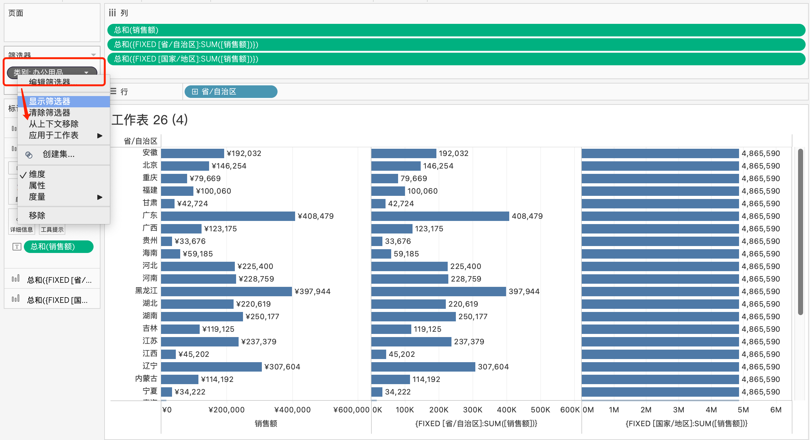

同样这里涉及一个优先级，**上下文筛选器**大于**fixed筛选器**大于**维度筛选器**  

总结：

1. 首先清楚fixed的公式，**先是指定维度**，**冒号后面指定是聚合计算的值**，这个值即可以是维度，也可以是度量  

           {FIXED [客户名称]:COUNTD([订单 Id])}  
2. fixed的作用**可以增加原先数据表里没有的计算列**，但需要**清楚fixed的底层运算逻辑**  
3. fixed也可以**指定多维度的聚合**，在原本的视图里添加我们指定层次的数据  
4. fixed除了指定维度，同时也**指定了聚合的值的范围**，**默认计算范围是整个数据表**  
5. **上下文筛选器** > **fixed筛选器** > **维度筛选器**  

我觉得我这个教程比网上的视频讲解细致多了  
