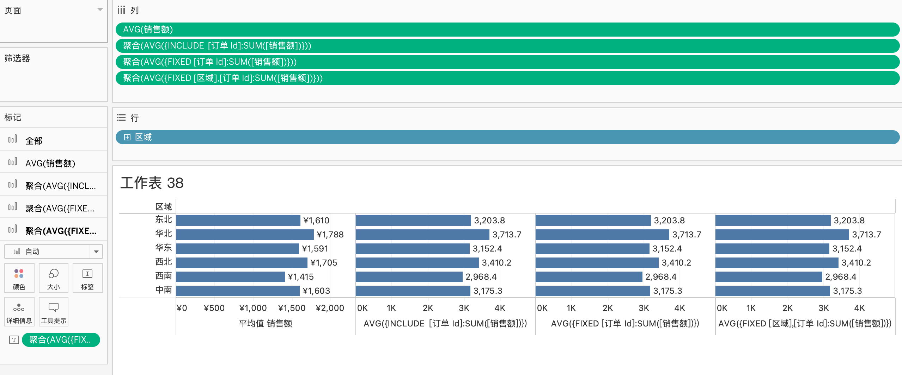
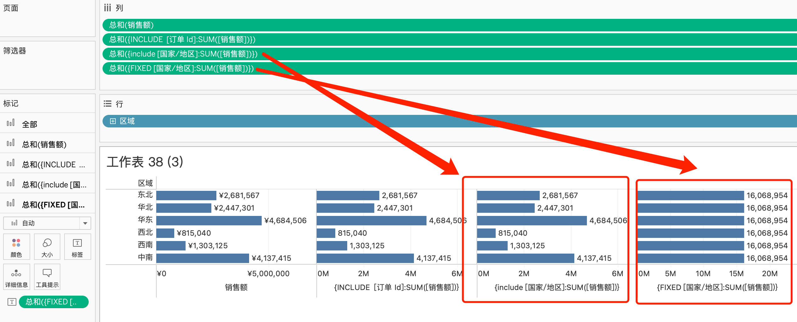
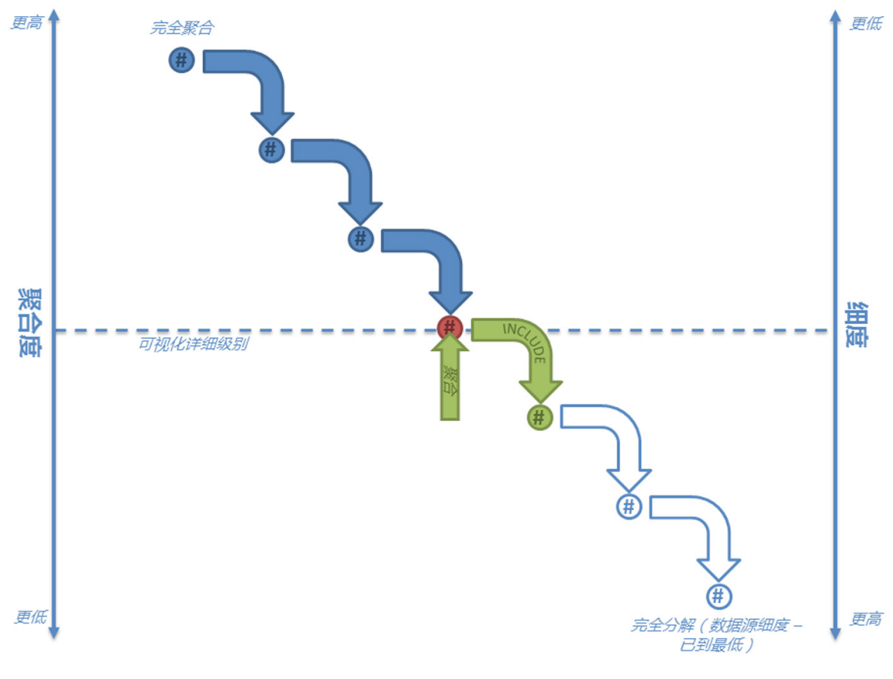
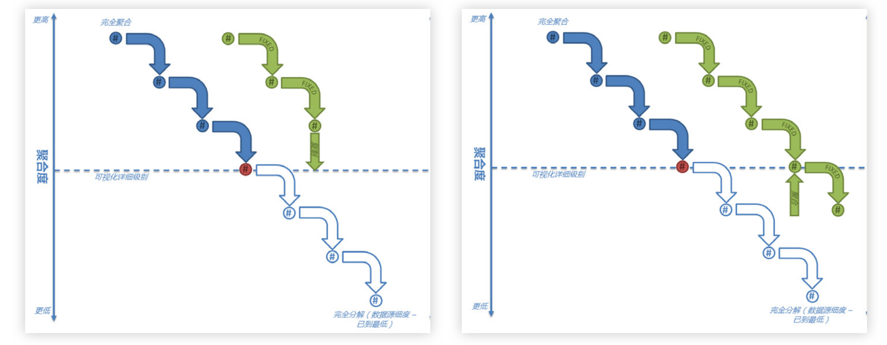
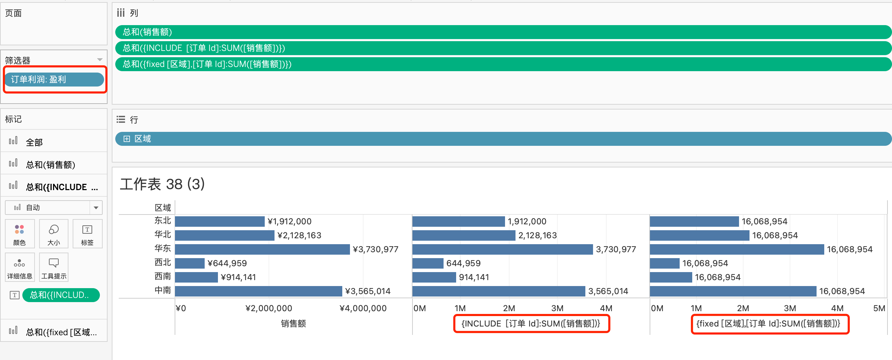
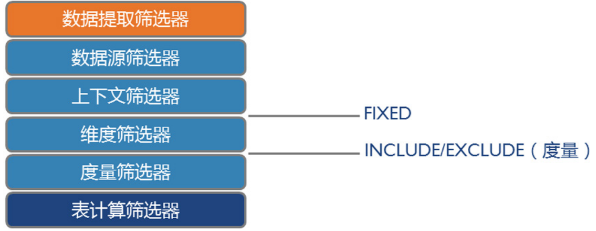
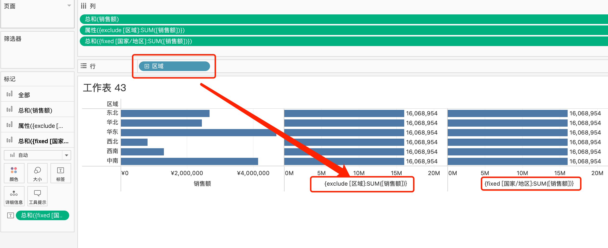
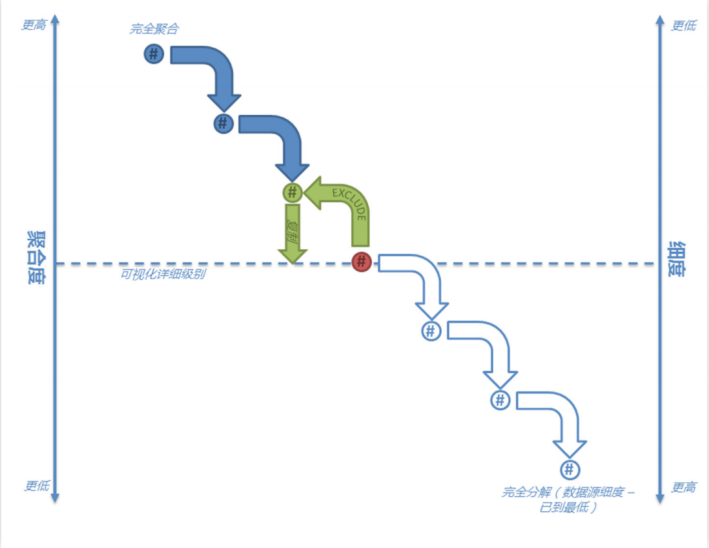
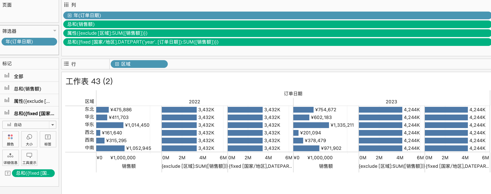

# 高级计算lod（下）

1. 本章节的重点是，讲清楚include、exclude的计算过程  
2. 了解include，exclude、fixed细微差别，在什么情况下，用哪个公式更加合适  

lod它们都有一个统一的点，就是**跨原先维度** *聚合* **其它维度的数据**,这就是lod`高级`的地点

>最开始lod公式给我造成一定的误解，就是说，它们的关键字不一样，所以在一样的维度，在冒号后面聚合的值一定不不相同，后面搞懂了它们的计算逻辑，才发现这是我自身的误解而已
>理解的关键：**使用include、exclude公式时，很多情况下也可以用fixed完成**

## include表达式

### include的计算逻辑

这一小节主要介绍include关键字，还是用例子来说明，同时也用fixed关键字实现  
还是以示例超市订单为例，我们想看**每个区域** **订单** 的 **平均销售额**

            AVG([销售额])
            AVG({INCLUDE  [订单 Id]:SUM([销售额])})
            AVG({FIXED [订单 Id]:SUM([销售额])}) # 不推荐
            AVG({FIXED [区域],[订单 Id]:SUM([销售额])}) # 推荐

`AVG([销售额])`这个公式的计算逻辑是先对**每个区域的销售额**进行sum汇总，然后**再除以行数**，这个值不是我们想要的平均订单销售额，如果还是不理解，仔细研究一下超市的订单数据表格  

`AVG({INCLUDE  [订单 Id]:SUM([销售额])})`这个公式的计算逻辑是先按照视图**区域**的维度对销售明细进行分组，**然后才对订单的销售额**进行sum汇总，最后**再除以订单数**，这个值就是我们想要的平均订单销售额  

`AVG({FIXED [订单 Id]:SUM([销售额])})`虽然计算出来的值是我们想要的，但它其实不严谨。在这个例子中，tableau默认帮我们在fixed里面补充了**区域**这个维度，最好别这样写  

`AVG({FIXED [区域],[订单 Id]:SUM([销售额])})`最好用这个写法，指明了**区域** **订单 Id**这两个层级的维度，计算逻辑更加严谨，理解起来也更加易懂

而在执行include之前，tableau是先按照**区域**的维度对销售明细进行分组，分组之后才进行lod计算（上个章节用python演示过fixed分组）  
INCLUDE是在视图现有维度的上进行分组，额外添加指定维度进行计算，最终结果会聚合回视图的维度层级，**这是include与fixed的重点区别**  
在强调一下，fixed计算的维度依据在fixed中就固定好了，而include的则还依赖原视图的维度  

### include的层级

fixed还有跟include有一个区别，那就是include表达式里面的维度，必须在视图维度的层级之下才行，否则就会出错

如果我们在区域的维度下，去计算全国的销售额，那么它返回的值是错误的，而用fixed则返回了正确的值  

            SUM([销售额])
            {INCLUDE  [订单 Id]:SUM([销售额])}
            {include [国家/地区]:SUM([销售额])} # 错误的层级，计算的结果是错误的
            {FIXED [国家/地区]:SUM([销售额])} # 正确的计算方式

这里include涉及到了一个层次关系，也就是include公式里面的维度，必须要在视图维度的层级之下，才能返回正确的值  
这个例子中，视图的层级是**区域**，而**国家**是在**区域**的层级之上，所以返回的值是错误的，而**订单 Id**的层级是在**区域**下面，所以返回的销售额汇总是正确的  

下图是讲解include计算逻辑，是在当前视图的维度下，用include去聚合更低维度的层级  

**而fixed则不理会视图的层级**，而是按照fixed里面指定**国家**的维度去计算销售额，最终将结果匹配到视图去  

fixed可以高于视图去聚合计算，也可以低于当前视图去计算，取决于fixed里面的维度  

### include的优先级

上面讲到include的计算逻辑，是在当前视图的维度下，用include去聚合更低维度的层级，所以include是受视图影响的，而视图受筛选器影响，所以include的计算的值是经过筛选器处理之后的  

举例说明，我们只想看盈利订单的销售额，这时候我们就会在筛选器里添加一个条件，只筛选盈利的订单，同时也用fixed公式做一下对比  

            IIF({FIXED [订单 Id]:SUM([利润])}>0,'盈利','亏损') # 筛选条件

            SUM([销售额])
            {INCLUDE  [订单 Id]:SUM([销售额])} # include受筛选器影响
            {FIXED [区域],[订单 Id]:SUM([销售额])} # fixed不受筛选器影响

可以看到说，include公式计算的销售额是受维度筛选器的影响的，而fixed不受维度筛选器影响，fixed计算的值是所有订单的销售额，这就是区别  

而如果我们只想通过fixed计算盈利订单的销售额，那么我们可以把维度筛选器加到**上下文环境**中，这时候fixed计算的值就是只包含盈利的的销售额（上篇介绍过）  

这个图就很好说明了筛选器与lod的计算的优先级  

一般比较少用到数据提取筛选器与数据源筛选器，重点是了解后面筛选器的优先级  
上下文筛选器 > fixed > 维度筛选器 > INCLUDE&EXCLUDE > 度量筛选器 > 表计算筛选器  

这里补充两个点：

1. EXCLUDE跟INCLUDE的优先级是一样的，后面会介绍EXCLUDE表达式  
2. INCLUDE 作为 LOD 表达式，会在度量筛选器之前完成计算，度量筛选器只能过滤 INCLUDE 计算后的结果，无法影响 INCLUDE 内部的计算逻辑

用一个表格来对比fixed与include的一些特性区别  

| 特性               | FIXED                               | INCLUDE                           |
|--------------------|-------------------------------------|-----------------------------------|
| 依赖视图维度       | 完全忽略视图维度                   | 基于视图维度 + 额外维度            |
| 筛选器影响         | 仅上下文筛选器生效                 | 所有筛选器生效                    |
| 计算粒度           | 独立于视图，直接按指定维度计算     | 在视图维度基础上添加新维度计算     |
| 结果聚合           | 直接匹配或重复值                   | 聚合回视图原有维度层级            |

## EXCLUDE表达式

在讲解了fixed表达式与include表达式之后，理解exclude表达式就好轻松很多  
exclude的维度计算逻辑跟include反过来，其它特点都是相似的  

### EXCLUDE的计算逻辑

还是以示例超市订单为例，我们想看**每个区域**的**销售额**同时展示全国的销售额  
这个例子中，我们用exclude以及fixed来计算全国的销售额  

            SUM([销售额])
            {exclude [区域]:SUM([销售额])}
            {fixed [国家/地区]:SUM([销售额])}
在这个视图中，我们以**区域**作为维度，`SUM([销售额])`是计算每个区域的销售额  

`{exclude [区域]:SUM([销售额])}`的意思是说，排除了**区域**的维度，去聚合计算全部的销售额，在这里就是全国的销售额  
`{fixed [国家/地区]:SUM([销售额])}`这个表达式这是以全国的维度去计算销售额，所以它跟上面的exclude的表达式计算的结果是一致的  

这里的exclude表达式计算公式里面的维度，必须要高于视图里面的维度；而include公式里面所涉及的维度则必须低于视图里的维度，这是exclude与include之间的重点区别  

EXCLUDE计算的关键点在于：Tableau会先从可视化详细级别中删除排除的维度并执行计算，假设该维度完全不存在，然后将相关结果直观显示出来。  

### exclude的优先级

与include一样，exclude表达式计算的值是经过**维度筛选器**筛选之后的  
例如我们想查看2022年、2023年每个区域的销售额，同时查看2022年、2023年整年的销售额，在这个例子中，我们一样也用fixed表达式实现  

            SUM([销售额])
            {exclude [区域]:SUM([销售额])}
            {fixed [国家/地区],DATEPART('year', [订单日期]):SUM([销售额])}

这个例子会比之前略微复杂，因为涉及了行、列都存在维度，行的维度是**区域**，列的维度是**订单时间-年**  
维度筛选器有一个**订单时间-年**的筛选器，保留2022年、2023年购买的订单  

`SUM([销售额])`计算的是**每年某个区域**的销售额  
`{exclude [区域]:SUM([销售额])}`的优先级是在**视图的维度**下面，所以exclude会受**区域，订单时间-年**这两个维度影响，但是exclude里面指定了忽略**区域**这个维度，所以它统计的结果就是，**每年**的整个国家的销售额  
`{fixed [国家/地区],DATEPART('year', [订单日期]):SUM([销售额])}`则是通过指定了**国家，订单时间-年**这两个维度，所以计算出来的是每年整个国家的销售额  

到这里LOD的计算表达式的内容就算讲完了  
但为了更好理解跟掌握LOD表达式，还是列一个表格，来区分它们各自的一些特性  

| 功能/特性        | FIXED                                                                 | INCLUDE                                                             | EXCLUDE                                                             |
|------------------|----------------------------------------------------------------------|--------------------------------------------------------------------|--------------------------------------------------------------------|
| **核心用途**     | 计算与视图详细级别**无关**的值，独立于视图中的维度。                 | 在视图中**添加额外维度**计算聚合值（基于视图维度+指定维度）。      | 在视图中**移除某些维度**计算聚合值（基于视图维度-指定维度）。      |
| **语法结构**     | `{FIXED [维度] : 聚合公式}`                                          | `{INCLUDE [维度] : 聚合公式}`                                      | `{EXCLUDE [维度] : 聚合公式}`                                      |
| **计算位置**     | 在数据源级别计算，忽略视图中的筛选器    | 在视图详细级别基础上扩展维度，受视图筛选器影响。                   | 在视图详细级别基础上减少维度，受视图筛选器影响。                   |
| **维度依赖性**   | 完全独立于视图中的维度（除非显式关联）。                             | 依赖视图中的维度，并在此基础上添加新维度。                         | 依赖视图中的维度，并在此基础上排除某些维度。                       |

## 总结

1. LOD高级表达式到这里就结束了，重点是搞清楚它们背后的计算逻辑  
2. 理解LOD表达式之间的差异，才能更好理解与应用，在适合的情况下选择相应的LOD满足自己的计算需要  
3. 掌握LOD与筛选器之间的优先级
    > 上下文筛选器 > fixed > 维度筛选器 > INCLUDE&EXCLUDE > 度量筛选器 > 表计算筛选器  
